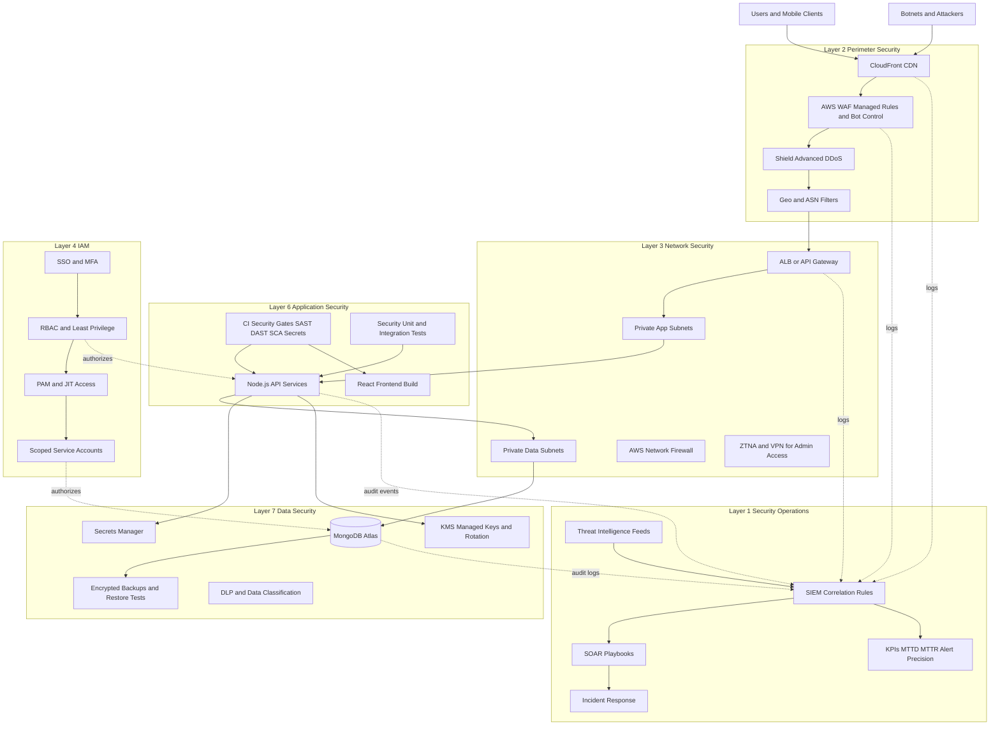

# SecurePay 7-Layer Security Architecture

This architecture is opinionated for a Node.js + React + MongoDB fintech workload deployed on AWS.

## Recommended Stack
- Edge: CloudFront + AWS WAF + Shield Advanced
- API: ALB or API Gateway -> Node.js services (ECS/Fargate)
- Data: MongoDB Atlas (private endpoint)
- Identity: IAM Identity Center + IdP (Okta/Entra)
- Security Ops: CloudTrail + Security Hub + GuardDuty + OpenSearch SIEM + PagerDuty
- Secrets: AWS Secrets Manager + KMS

## Layered Architecture Diagram

## Layer Interaction Summary
- Layer 2 blocks volumetric and known-bad traffic before it reaches your app.
- Layer 3 limits lateral movement and enforces private-only east-west paths.
- Layer 4 controls who can do what, including admin break-glass access.
- Layer 6 prevents exploitable code from shipping and enforces runtime guardrails.
- Layer 7 keeps financial and identity data protected even if app controls fail.
- Layer 1 gives detection, triage, and automated response across all layers.

## Top 3 Attack Paths and Countermeasures
1. Account takeover and session abuse
- Controls: MFA, login throttling, bot defense, impossible-travel detection, JIT admin access.
2. API fraud automation on transfer endpoints
- Controls: WAF bot rules, route-level rate limits, fraud scoring, SIEM anomaly alerts.
3. Data exfiltration after foothold
- Controls: private network segmentation, least-privilege IAM, encryption at rest/in transit, DLP.
